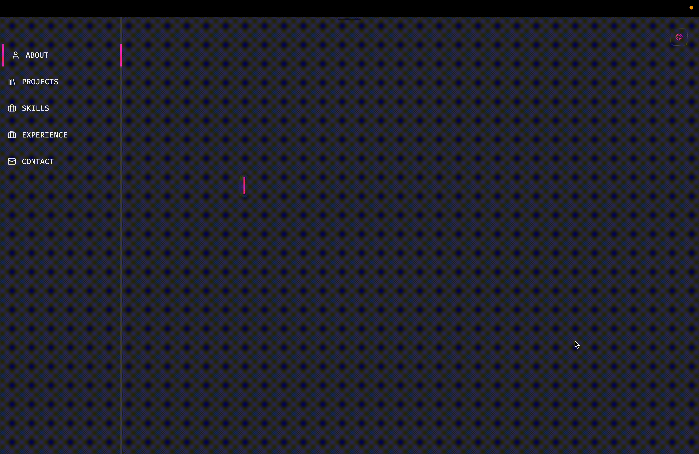

<h1 align="center">🐈 Marcelle Yanari's Portfolio</h1>
<p align="center">
  A little place on the web to show what I’ve been building.
</p>

<p align="center">
  <a href="https://portfolio-yanari.vercel.app"><strong>🌐 Visit Live Site</strong></a>
</p>

<p align="center">
  
</p>


## ✨ About Me

Hey! I'm Marcelle Yanari — a passionate frontend & mobile developer who loves clean code, pastel VSCode themes, and cats.  
I’ve been working with tech since 2019 and I’m always finding creative ways to make apps that are fast, fun, and user-friendly.

This portfolio is where I keep my digital playground — it showcases my latest work, my experience, and gives people an easy way to connect with me.


## 📦 What's Inside?

### 🔍 Sections
- 💼 Projects
- 🧠 Skills
- 🚀 Experience
- 📬 Contact Me

### 🔧 Built With
- [Next.js](https://nextjs.org/)
- [Tailwind CSS](https://tailwindcss.com/)
- [Framer Motion](https://www.framer.com/motion/)
- [Radix UI](https://www.radix-ui.com/) for accessible UI components
- [Next Themes](https://github.com/pacocoursey/next-themes) for theme switching
- [Vercel](https://vercel.com/) for deployment

### 🔮 Features
- 🎨 Dynamic **theme switcher** based on VSCode themes (Dracula, Synthwave, Atom One Dark)
- 📱 **Responsive design** for mobile and desktop
- 🎬 Smooth **animations** across pages
- 🌈 Entire site adapts to the selected theme — not just colors

---

## 🧪 How to Run Locally

```bash
# Clone the repo
git clone https://github.com/yanari/portfolio.git

# Move into the folder
cd portfolio

# Install dependencies
npm install

# Run the dev server
npm run dev
````

Now open http://localhost:3000 in your browser 🚀

## 🗺️ Roadmap / Coming Soon
- 🗂️ Route for browsing all projects

- ♿ Accessibility improvements to the theme picker (Headless UI or Radix)

- 🎈 “Contact Me” section with more personality and interactivity

## 💌 Want to Chat?
If you have feedback, suggestions, or just want to say hi, feel free to [open an issue](https://github.com/yanari/portfolio/issues) or reach out!

