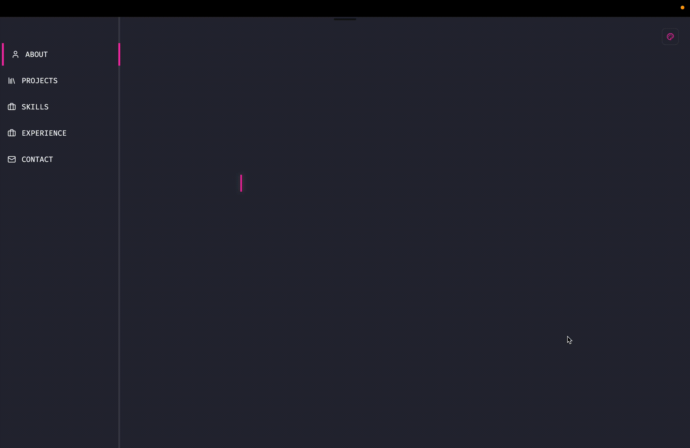

<h1 align="center">🐈 Marcelle Yanari — Portfolio</h1>
<p align="center">Senior Frontend & Mobile Developer. This portfolio is a code editor you scroll through.</p>

<p align="center">
  <a href="https://portfolio-yanari.vercel.app"><strong>🌐 Visit Live Site</strong></a>
</p>

<p align="center">
  
</p>

## What's inside

Each section is a "file" in an editor workspace:

| File             | Section                                                |
| ---------------- | ------------------------------------------------------ |
| `profile.ts`     | Who I am, rendered as a typed object                   |
| `README.md`      | About me                                               |
| `projects/`      | Work and personal projects, browsable like a file tree |
| `experience.log` | Career as a `git log`                                  |
| `stack.json`     | Skills grouped by what I do with them                  |
| `contact.sh`     | Contact links and form                                 |

- 🎨 Editor themes (Atom One Dark, Dracula, SynthWave '84), each a full palette for workbench + syntax
- 🌎 English (`/`) and Portuguese (`/pt`)
- 📱 Responsive workbench: docked explorer on desktop, overlay on tablet, tabs on mobile
- ♿ Keyboard navigation, visible focus, reduced motion, WCAG AA contrast in every theme
- ⚡ Static pages, zero syntax-highlighting JS

## Built with

[Next.js](https://nextjs.org/) · [Tailwind CSS](https://tailwindcss.com/) · [next-themes](https://github.com/pacocoursey/next-themes) · [Radix UI](https://www.radix-ui.com/) · [Web3Forms](https://web3forms.com/) · [Vercel](https://vercel.com/)

## Editing content

All copy lives in `content/` (`profile.ts`, `about.ts`, `projects.ts`, `experience.ts`, `stack.ts`, `i18n.ts`), with English and Portuguese side by side. Optional project fields that are left out simply don't render. `TODO(marcelle)` marks things only I can fill in.

## Resume

`pnpm resume` generates ATS-friendly resumes (PDF + DOCX, English + Portuguese) into `public/` from the same `content/` files the site uses. Resume-only bullets live in `content/resume.ts`. PDF rendering uses local Chrome (`CHROME_PATH` to override).

## Adding a theme

1. Create `themes/my-theme.ts` exporting an `EditorTheme` (see `themes/types.ts`)
2. Register it in `themes/index.ts`

The CSS variables and the theme picker are generated from that registry.

## Run locally

```bash
pnpm install
pnpm dev
```
